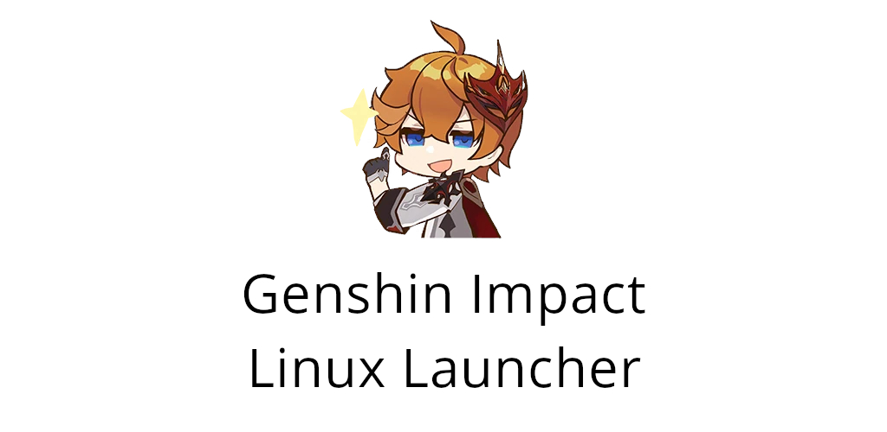
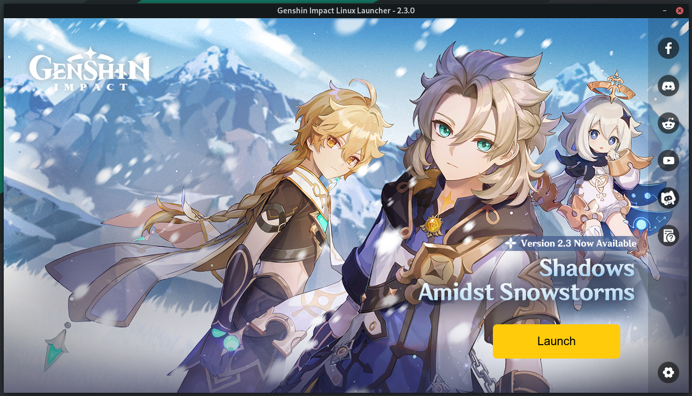
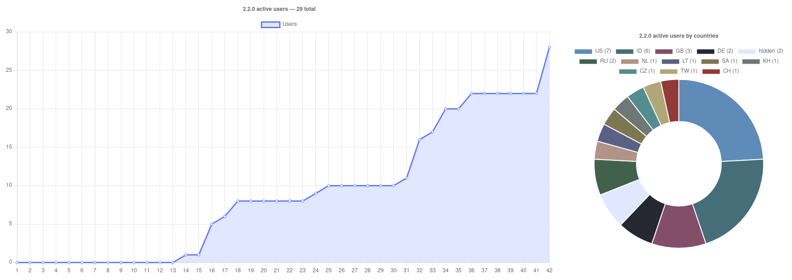

<br><br>

### Please, try to use "An Anime Game" phrase instead of the real game name to avoid search engines parsing

<br><br>

# About 2.3.0 update

1. To update background image, change the launcher language to some another, return it back **and restart to refresh the launch button's state**
2. After you press the update button, everything will be ok before launcher will not stop at the end of the process. You should close the launcher, go to the `~/local/share/an-anime-game` folder and change the version field in the `config.json` file to the `2.3.0`
3. After that you can launch the launcher
4. You will receive analytics window. Please, participate)
5. **DON'T PRESS THE "TEST PATCH" BUTTON**. That's a error and I don't want to know what will happen if you will press it. Just wait before I will make a hot fixes of all these issues

More datailed info you can find in our discord server. Fixes will be uploaded today, so you can just wait before I will make a `1.5.6` launcher version

# Status

| Game version | Launcher version | Patch version |
| :---: | :---: | :---: |
| 2.3.0 | 1.5.5 | 2.2.0 stable ❌ |

> ⚠️ New patch's version will be delayed for a week because of some author's personal reasons

We have our own [An Anime Game](https://discord.gg/MA8fTBarfj) discord server where you can ask any questions

### AppImage

Download AppImage from [Releases](https://notabug.org/nobody/an-anime-game-launcher/releases) page

### For arch users

This launcher also available as the [an-anime-game-launcher](https://aur.archlinux.org/packages/an-anime-game-launcher) AUR repository

<br>

## Usage statistics

### 2.2.0



> You can suggest colors for your countries

<br>

# Requirements

To work this launcher requires

* wine
* winetricks
* unzip
* tar
* git

## Install

### apt-get

```sh
sudo apt-get install wine winetricks unzip tar git
```

### pacman

```sh
sudo pacman -Syu wine winetricks unzip tar git
```

# Additional requirements

| Name | Description |
| --- | --- |
| [MangoHud](https://github.com/flightlessmango/MangoHud) | To use MangoHud |
| [vkBasalt](https://github.com/DadSchoorse/vkBasalt) | To use shaders |

These requirements can't be easily installed so you should do it manually

They're required only for some specific functions

# Development

## Build from source

```sh
npm run build
```

## Run from source

```sh
npm start
```

# Roadmap

### ✓ <s>To 1.0.0 release</s>

* <s>Fix AppImage builds</s> *(0.3.0)*
* <s>Parse background banners from the game's API ([issue #1](https://notabug.org/nobody/an-anime-game-launcher/issues/1), [pull request #2](https://notabug.org/nobody/an-anime-game-launcher/pulls/2))</s> *(0.3.0)*
* <s>Update launcher logo</s> *(0.4.0)*
* <s>Cache launcher background picture ([pull request #6](https://notabug.org/nobody/an-anime-game-launcher/pulls/6))</s> *(0.4.0)*
* <s>Make Proton-GE default compatibility tool and fix game input issues</s> (added runners manager) *(0.5.0)*
* <s>Add preferences menu</s> *(0.5.0)*
* <s>Add additional telemetry checking</s> *(0.6.0)*
* <s>Add DXVK downloading in settings</s> *(0.6.0)*
* <s>Make participation in the anonymous analytics request</s> *(0.8.0)*
* <s>Add launcher updates notifications</s> *(1.0.0-rc1)*
* <s>Make automatic patch state parsing</s> *(1.0.0-rc1)*

### ➤ To 2.0.0 release

* <s>Add runners environmental variables manager</s> *(1.1.0)*
* <s>Add outdated files deletion when new game's update releases</s> *(1.1.0)*
* <s>Add installed packages deletion</s> *(1.2.0)*
* <s>Add voice packs support</s> (Thank @Maroxy for the developments in the previous versions) *(1.3.0)*
* <s>Color variants for progress bar's downloading text dependent on the background picture primary color</s> *(1.4.0, LAB-based in 1.5.3)*
* <s>Playing statistics</s> *(1.4.1)*
* <s>MangoHud support</s> (added HUD selector) *(1.5.0)*
* <s>Add vkBasalt support and "shaders library"</s> *(1.5.0)*
  - [yagocl's](https://notabug.org/Krock/GI-on-Linux/src/master/static/vkBasalt_yagocl.conf) basic sharpening preset *(without pictures)*
  - [notahuman's](https://notabug.org/Krock/GI-on-Linux/src/master/static/vkBasalt_notahuman.conf) prime preset v2
* <s>Make shaders manager hidden if vkBasalt is not installed</s> *(1.5.4)*
* <s>Make MangoHud option hidden if it is not installed</s> *(1.5.4)*
* DXVK logs auto-deletion option
* Wine prefix folder selection
* Game's update pre-installation
* Screenshots explorer
* Make force launch button when the launcher's repository is unavailable *(waiting for the repository's unavailability lmao)*
* Set default wine version to download so the wine install requirement is no longer needed
* Add Patch category in settings menu with
  - Always participate in patches testing
  - Applying anti login crash patch
  - Remove patch

And don't forget to change the patch's URI when it will be changed

> Now I'm working on moving the project to the Tauri. Also for some personal reasons I, like the patch's author, will be busy, but until Christmas, so it's a bit more than a month. I will make some critical updates if they will be required, but the development will be frozen for this period. I hope you will enjoy playing the game, and I will enjoy continuing the development of this project
>
> And, by the way, @Maroxy helped me to create the discord server for this project. I will sometimes appear there and you will be able to ask me about something if you want, ehe
> 
> November 22
