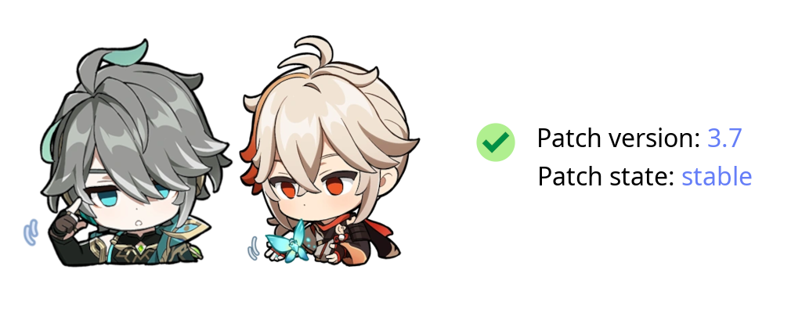
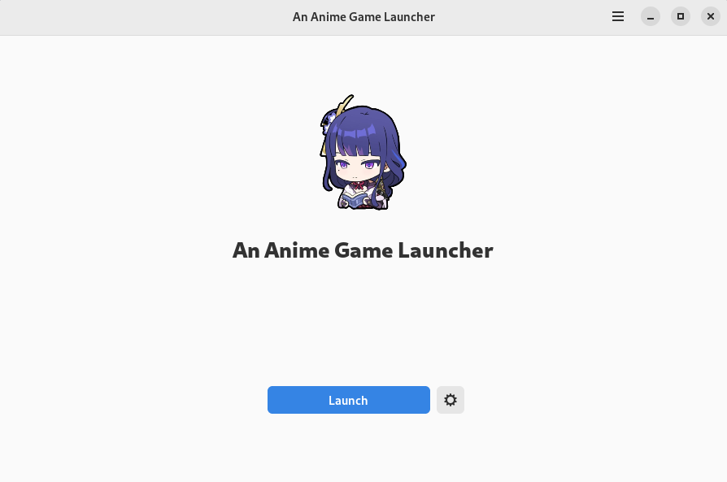
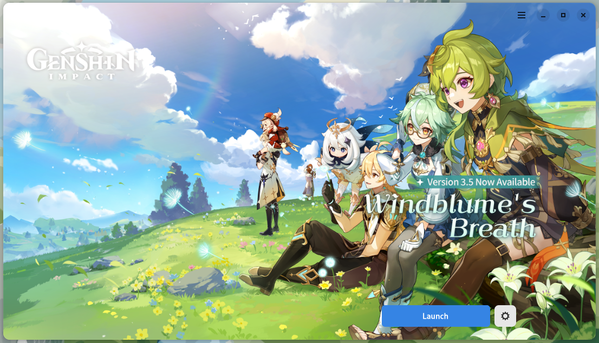
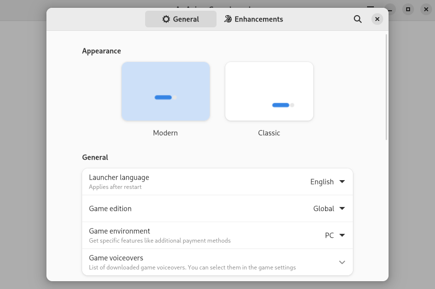
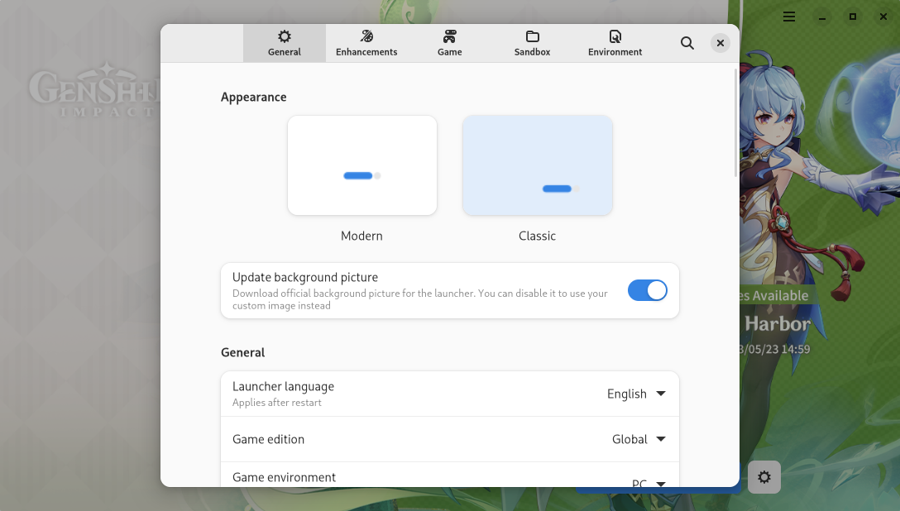
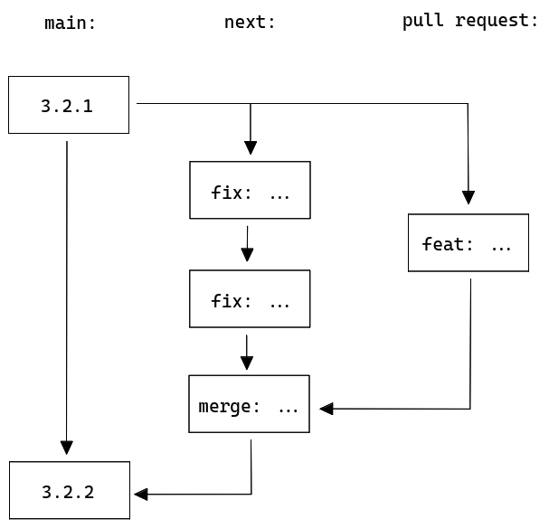

<picture>
    <source media="(prefers-color-scheme: dark)" srcset="repository/logo-dark.png">
    
</picture>

| Modern style | Classic style |
| :-: | :-: |
| <picture><source media="(prefers-color-scheme: dark)" srcset="repository/main-modern-dark.png"></picture> | <picture><source media="(prefers-color-scheme: dark)" srcset="repository/main-classic-dark.png"></picture> |
| <picture><source media="(prefers-color-scheme: dark)" srcset="repository/settings-modern-dark.png"></picture> | <picture><source media="(prefers-color-scheme: dark)" srcset="repository/settings-classic-dark.png"></picture> |

<p align="center">
    <a href="https://discord.gg/ck37X6UWBp">Discord</a> ·
    <a href="https://matrix.to/#/#an-anime-game:envs.net">Matrix</a> ·
    <a href="https://github.com/an-anime-team/an-anime-game-launcher/wiki">Wiki</a>
</p>

<br>

# ⚠️ Please don't link to this repository

We understand you want to help people run An Anime Game on Linux. The issue is, the more people know
of the tools involved in it, the higher the chances The Anime Game Company will notice them, and then
fix the flaws that let us do the needful.

While sharing in your self-managed chat services and through private messaging is fine, we humbly ask
that you refrain from publically sharing links to this repository, or to any of the tools involved.

Or share them and ruin it for the dozens of Linux players. It's up to you.

## If you're going to share it anyway

Do what you must, but we would respectfully request that you try to label the game as "An Anime Game"
instead of the actual name of the game, to avoid search engine parsing.

<br>

# ♥️ Useful links and thanks

* Original patch project without which this project wouldn't be possible. Link is omitted for "privacy" purposes
* [macOS launcher](https://github.com/3Shain/yet-another-anime-game-launcher) which contains some additional compatibility components
* [Wiki](https://github.com/an-anime-team/an-anime-game-launcher/wiki) contains some basic FAQ, installation instructions and more
* [Releases page](https://github.com/an-anime-team/an-anime-game-launcher/releases) where you can find latest available version
* [Changelog](CHANGELOG.md) with chronology of the project

<br>

# ⬇️ Download

| Format | Wiki | Source |
| - | - | - |
| Flatpak | [link](https://github.com/an-anime-team/an-anime-game-launcher/wiki/Installation#-any-distribution-flatpak) | - |
| AUR | [link](https://github.com/an-anime-team/an-anime-game-launcher/wiki/Installation#-arch-linux-aur) | [an-anime-game-launcher-bin](https://aur.archlinux.org/packages/an-anime-game-launcher-bin) |
| RPM | [link](https://github.com/an-anime-team/an-anime-game-launcher/wiki/Installation#-fedora-rpm) | [AAGL](https://build.opensuse.org/repositories/home:Maroxy:AAT-Apps/AAGL) |
| Ubuntu (pacstall) | - | [an-anime-game-launcher-bin](https://pacstall.dev/packages/an-anime-game-launcher-bin) |
| Gentoo (ebuild) | [link](https://github.com/an-anime-team/an-anime-game-launcher/wiki/Installation#-gentoo-linux-ebuild) | [aagl-ebuilds](https://github.com/an-anime-team/aagl-ebuilds) |
| NixOS (nixpkg) | [link](https://github.com/an-anime-team/an-anime-game-launcher/wiki/Installation#-nixos-nixpkg) | [aagl-gtk-on-nix](https://github.com/ezKEa/aagl-gtk-on-nix) |

To see the installation guides, please visit the wiki page [here](https://github.com/an-anime-team/an-anime-game-launcher/wiki/Installation)

## Chinese version support

This should be automatically enabled if you're using zh_cn (Chinese) as your system language. If you're not using it - you can change the game edition in the launcher settings

<br>

# 💻 Development

| Folder | Description |
| - | - |
| src | Rust source code |
| assets | App assets folder |
| assets/locales | App localizations |
| target/release | Release build of the app |

## Clone repo

```sh
git clone --recursive https://github.com/an-anime-team/an-anime-game-launcher
```

## Run app

```sh
cargo run
```

## Build app

```sh
cargo build --release
```

## Updates strategy

Starting from 3.2.1 ([fcab428](https://github.com/an-anime-team/an-anime-game-launcher/commit/fcab428cb40b1457f41e0856f9d1e1473acbe653)) we have 2 branches: stable ([main](https://github.com/an-anime-team/an-anime-game-launcher/tree/main)) and dev ([next](https://github.com/an-anime-team/an-anime-game-launcher/tree/next)). Code changes will be pushed into dev branch and merged into stable once they're ready for new version release


