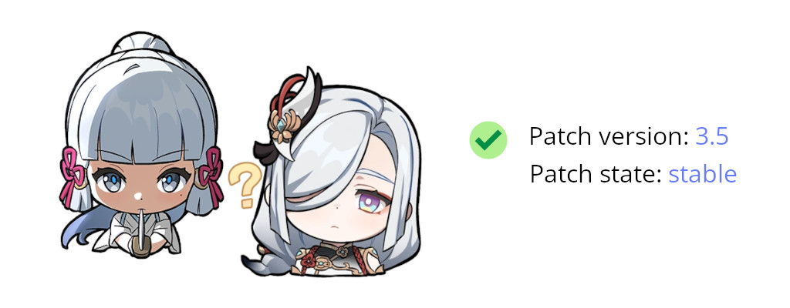

| Modern style | Classic style |
| :-: | :-: |
|  |  |
|  |  |

<br>

<p align="center">We have our own <a href="https://discord.gg/ck37X6UWBp">An Anime Game</a> discord server where you can ask any questions</p>

<br><br>

# Please don't link to this repository

We understand you want to help people run An Anime Game on Linux. The issue is, the more people know
of the tools involved in it, the higher the chances The Anime Game Company will notice them, and then
fix the flaws that let us do the needful.

While sharing in your self-managed chat services and through private messaging is fine, we humbly ask
that you refrain from publically sharing links to this repository, or to any of the tools involved.

Or share them and ruin it for the dozens of Linux players. It's up to you.

## If you're going to share it anyway

Do what you must, but we would respectfully request that you try to label the game as "An Anime Game"
instead of the actual name of the game, to avoid search engine parsing.

<br><br>


# Documentation

Documentation for the launcher can be found in the [repository wiki](https://github.com/an-anime-team/an-anime-game-launcher/wiki).

# Download

| Source | Link |
| --- | --- |
| Native | [Releases](https://github.com/an-anime-team/an-anime-game-launcher/releases) page |
| AUR | [an-anime-game-launcher-bin](https://aur.archlinux.org/packages/an-anime-game-launcher-bin) |
| Pacstall | [an-anime-game-launcher-bin](https://pacstall.dev/packages/an-anime-game-launcher-bin) |
| Gentoo | [an-anime-game-launcher](https://github.com/an-anime-team/aagl-ebuilds) |
| RPM | [an-anime-game-launcher](https://build.opensuse.org/repositories/home:Maroxy:AAT-Apps/AAGL) |
| NixOS | [an-anime-game-launcher](https://github.com/ezKEa/aagl-gtk-on-nix) |

## Flatpak support

To install the launcher via flatpak you will first have to make sure that you have flathub's remote installed

```zsh
flatpak remote-add --if-not-exists flathub https://flathub.org/repo/flathub.flatpakrepo
```

After installing flathub's remote you install launcher.moe's remote

NOTE: You can install the repo on a per user base by appending --user after --if-not-exists (This is especially useful if on Steam Deck)

```zsh
flatpak remote-add --if-not-exists launcher.moe https://gol.launcher.moe/gol.launcher.moe.flatpakrepo
```

Now the only thing remaining is to install the launcher

```zsh
flatpak install launcher.moe moe.launcher.an-anime-game-launcher
```

Some additional configuration is possible when using the flatpak. For info about this, see [this page](https://github.com/an-anime-team/an-anime-game-launcher-flatpak/blob/rust-launcher/README.md)

## Chinese version support

This should be automatically enabled if you're using zh_cn (Chinese) as your system language. If you're not using it - you'll need to set `China` as your `launcher.edition` in the `config.json` file

# Development

| Folder | Description |
| - | - |
| anime-launcher-sdk | Unified core functionality for the launcher |
| src | Rust source code |
| assets | App assets folder |
| assets/locales | App localizations |
| target/release | Release build of the app |

## Clone repo

```sh
git clone --recursive https://github.com/an-anime-team/an-anime-game-launcher
```

## Run app

```sh
cargo run
```

## Build app

```sh
cargo build --release
```
