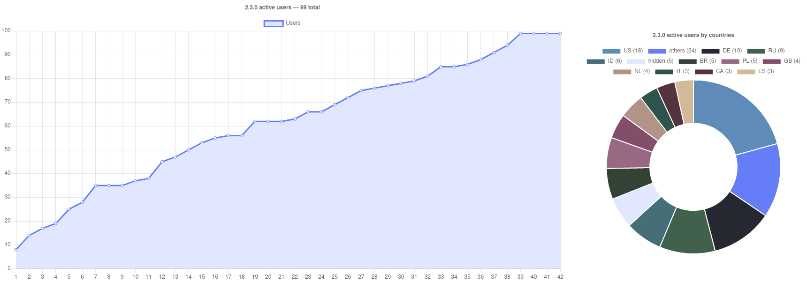

<br><br>

### Please, try to use "An Anime Game" phrase instead of the real game name to avoid search engines parsing

<br><br>

# Status

| Game version | Launcher version | Patch version |
| :---: | :---: | :---: |
| 2.4.0 | 2.1.0 | 2.4.0 stable ✅ |

We have our own [An Anime Game](https://discord.gg/ck37X6UWBp) discord server where you can ask any questions

### AppImage

Download AppImage from [Releases](https://gitlab.com/KRypt0n_/an-anime-game-launcher/-/releases) page

### For arch users

This launcher is also available as the [an-anime-game-launcher-bin](https://aur.archlinux.org/packages/an-anime-game-launcher-bin) AUR package

### Pacstall support

This launcher is also available as the pacstall package:

```zsh
pacstall -I an-anime-game-launcher-bin
```

<br>

## Usage statistics

This is our current usage statistics. You can find older ones [here](repository/pages/STATISTICS.md)

### 2.3.0 — 99 total



> You can suggest colors for your countries

<br>

# Requirements

To work this launcher requires

| Name | Description |
| --- | --- |
| webkit2gtk | To run Neutralino apps |
| libappindicator-gtk3 | To run Neutralino apps |
| unzip | To unpack zip archives (DXVKs / wines) |
| tar | To unpack tar archives (DXVKs / wines) |
| git | To check for new versions of the launcher |
| curl | To download archives with game, voice data, runners and so on |
| xdelta3 | To apply the patch to the game |
| cabextract | To install fonts to the wine prefix |
| libnotify | To send system notifications |

## Install

### apt-get

```sh
sudo apt-get install unzip tar git curl xdelta3 cabextract libnotify
```

### pacman

```sh
sudo pacman -Syu unzip tar git curl xdelta3 cabextract libnotify
```

### dnf

```sh
sudo dnf install unzip tar git curl xdelta cabextract libnotify
```

# Additional requirements

| Name | Description |
| --- | --- |
| [MangoHud](https://github.com/flightlessmango/MangoHud) | To use MangoHud |
| [vkBasalt](https://github.com/DadSchoorse/vkBasalt) | To use shaders |
| [GameMode](https://github.com/FeralInteractive/gamemode) | To use GameMode (performance optimization) |
| [switcheroo-control](https://gitlab.freedesktop.org/hadess/switcheroo-control/) | To select the GPU launcher should use to run the game |

These requirements can't be easily installed so you should do it manually

They're required only for some specific functions

# Development

## Download

```sh
git clone https://gitlab.com/KRypt0n_/an-anime-game-launcher
cd an-anime-game-launcher
yarn
yarn neu update
```

## Run

```sh
yarn dev
```

## Build

```sh
yarn build
```

## Bundle to AppImage

```sh
yarn bundle
```

# Roadmap

This is our current roadmap goals. You can find older ones [here](repository/pages/ROADMAP.md)

## ➤ To 3.0.0 release

### Features

* <s>Use `LauncherLib.getGameVersion` function instead of the `config.json`'s `version` property</s> *(deprecated due to the new core functions)*
* <s>Fix button flickering at start when the launcher's state updates</s> *(fixed due to the new framework usage and proper state updating)*
* <s>Add downloading pause button</s> *(2.0.0 release)*
* <s>Move launcher on [Empathize](https://github.com/empathizejs/framework)</s> *(2.1.0)*
* <s>Make notifications translations</s> *(2.1.0)*
* <s>ToS Violation Window</s> *(2.1.0)*
* Add `latest.log` file generation
* Implement manual config flushing functionality from the Empathize's API
* Add analytics window
* Add an option to show terminal with the wine's log of the game
* Dark progress bar design
* Statistics window
* Changelog window
* Screenshots explorer
* Add Patch category in settings menu with
  - Always participate in patches testing
  - Applying anti login crash patch
  - Remove patch
