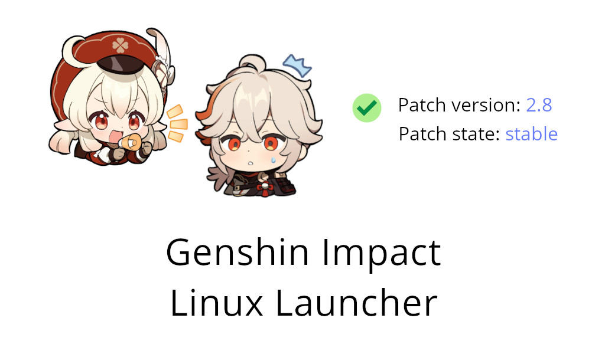
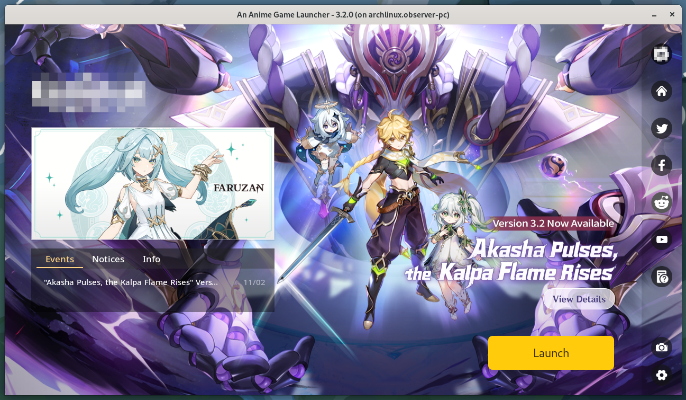
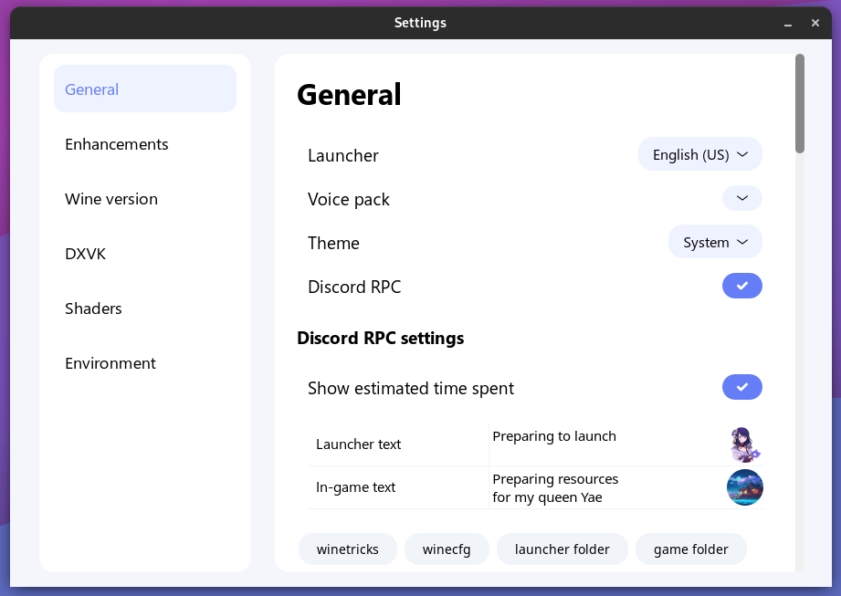
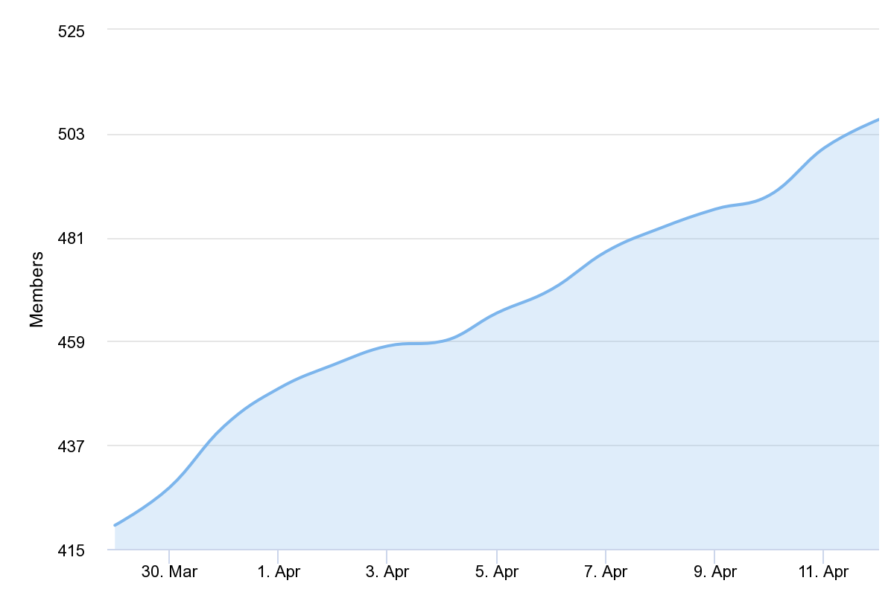
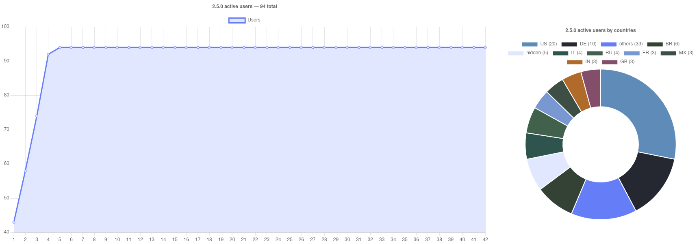

<br><br>

> Arts sources:
> 
> Ayaka: https://genshin-impact.fandom.com/wiki/Kamisato_Ayaka/Media?file=Icon_Emoji_Paimon%2527s_Paintings_Kamisato_Ayaka_1.png

<br><br>

# Please don't link to this repository

We understand you want to help people run An Anime Game on Linux. The issue is, the more people know
of the tools involved in it, the higher the chances The Anime Game Company will notice them, and then
fix the flaws that let us do the needful.

While sharing in your self-managed chat services and through private messaging is fine, we humbly ask
that you refrain from publically sharing links to this repository, or to any of the tools involved.

Or share them and ruin it for the dozens of Linux players. It's up to you.

## If you're going to share it anyway

Do what you must, but we would respectfully request that you try to label the game as "An Anime Game"
instead of the actual name of the game, to avoid search engine parsing.
<br><br>

# Download

| Source | Link |
| --- | --- |
| AppImage | [Releases](https://gitlab.com/KRypt0n_/an-anime-game-launcher/-/releases) page |
| AUR | [an-anime-game-launcher-bin](https://aur.archlinux.org/packages/an-anime-game-launcher-bin) |
| Pacstall | [an-anime-game-launcher-bin](https://pacstall.dev/packages/an-anime-game-launcher-bin) |

## Flatpak support

To install the launcher via flatpak you will first have to make sure that you have flathub's remote installed

```zsh
flatpak remote-add --if-not-exists flathub https://flathub.org/repo/flathub.flatpakrepo
```

After installing flathub's remote you install launcher.moe's remote

```zsh
flatpak remote-add --if-not-exists launcher.moe https://gol.launcher.moe/gol.launcher.moe.flatpakrepo
```

Now the only thing remaining is to install the launcher

```zsh
flatpak install launcher.moe com.gitlab.KRypt0n_.an-anime-game-launcher
```

Some additional configuration is possible when using the flatpak. For info about this, see [this page](https://gitlab.com/lane__/an-anime-game-launcher-flatpak/-/blob/master/README.md)

## Chinese version

To use Chinese version of the game make sure that you have

```yaml
server: cn
```

field in your `config.yaml` file (settings -> launcher folder). If your system uses the Chinese language - then it should be selected automatically. If not, then close the launcher, replace `server: global` with `server: cn`, and run it again. After that launcher will download the Chinese version of the game and the patch

# Status

| Game version | Launcher version | Patch version |
| :---: | :---: | :---: |
| 2.6.0 | 2.3.1 | 2.6.0 stable ✅ |

We have our own [An Anime Game](https://discord.gg/ck37X6UWBp) discord server where you can ask any questions

## Usage statistics

This is our current usage statistics. You can find older ones [here](repository/pages/STATISTICS.md)

### Our discord server — 549 members



### 2.6.0 launcher users — 231 total



<br>

# Requirements

To work this launcher requires

| Name | Description |
| --- | --- |
| webkit2gtk | To run Neutralino apps |
| libayatana-appindicator3-1 | To run Neutralino apps |
| unzip | To unpack zip archives (DXVK / Wine) |
| tar | To unpack tar archives (DXVK / Wine) |
| git | To check for new versions of the launcher |
| curl | For archive downloads: game, voice data, runners and so on |
| xdelta3 | To apply the patch to the game (compiled with LZMA support) |
| cabextract | To install fonts to the Wine prefix |
| libnotify | To send system notifications |

## Install

### apt

```sh
sudo apt install unzip tar git curl xdelta3 cabextract libnotify-bin libayatana-appindicator3-1
```

### pacman

```sh
sudo pacman -Syu unzip tar git curl xdelta3 cabextract libnotify
```

### dnf

```sh
sudo dnf install unzip tar git curl xdelta cabextract libnotify webkit2gtk3
```

And `libayatana-appindicator` package with its requirements (since they haven't been pushed to the fedora's repos):

| Name | Link |
| - | - |
| libayatana-ido | [rpm](https://download.opensuse.org/tumbleweed/repo/oss/x86_64/libayatana-ido3-0_4-0-0.9.0-1.3.x86_64.rpm) / [details](https://mirrorcache.opensuse.org/tumbleweed/repo/oss/x86_64/libayatana-ido3-0_4-0-0.9.0-1.3.x86_64.rpm.mirrorlist) |
| libayatana-indicator | [rpm](https://download.opensuse.org/tumbleweed/repo/oss/x86_64/libayatana-indicator3-7-0.9.0-1.6.x86_64.rpm) / [details](https://mirrorcache.opensuse.org/tumbleweed/repo/oss/x86_64/libayatana-indicator3-7-0.9.0-1.6.x86_64.rpm.mirrorlist) |
| libayatana-appindicator | [rpm](https://download.opensuse.org/tumbleweed/repo/oss/x86_64/libayatana-appindicator3-1-0.5.90-1.3.x86_64.rpm) / [details](https://mirrorcache.opensuse.org/tumbleweed/repo/oss/x86_64/libayatana-appindicator3-1-0.5.90-1.3.x86_64.rpm.mirrorlist) |

Install them in the same order as in the table above using the command:

```sh
sudo rpm -i <path to rpm file>
```

# Additional requirements

| Name | Description |
| --- | --- |
| [MangoHud](https://github.com/flightlessmango/MangoHud) | To use MangoHud |
| [vkBasalt](https://github.com/DadSchoorse/vkBasalt) | To use shaders |
| [GameMode](https://github.com/FeralInteractive/gamemode) | To use GameMode (performance optimization) |

These requirements can't be easily installed so you should do it manually

They're required only for some specific functions

# Development

## Download source

```sh
git clone https://gitlab.com/KRypt0n_/an-anime-game-launcher
cd an-anime-game-launcher
yarn
yarn neu update
```

## Run

```sh
yarn dev
```

## Build

```sh
yarn build
```

## Bundle to AppImage

```sh
yarn bundle
```

# Roadmap

This is our current roadmap goals. You can find older ones [here](repository/pages/ROADMAP.md)

## ➤ To 3.0.0 release

### Features

* <s>Use `LauncherLib.getGameVersion` function instead of the `config.json`'s `version` property</s> *(deprecated due to the new core functions)*
* <s>Fix button flickering at start when the launcher's state updates</s> *(fixed due to the new framework usage and proper state updating)*
* <s>Add downloading pause button</s> *(2.0.0 release)*
* <s>Move launcher on [Empathize](https://github.com/empathizejs/framework)</s> *(2.1.0)*
* <s>Make notifications translations</s> *(2.1.0)*
* <s>ToS Violation Window</s> *(2.1.0)*
* <s>Add `latest.log` file generation</s> *(2.1.2)*
* <s>Add an option to show terminal with the wine's log of the game</s> *(7375c743, released in 2.1.3)*
* <s>Add analytics window</s> *(e0a09323, released in 2.2.0)*
* <s>Add Chinese game's version support (due to changes in the Krock's patch)</s> *(75f2ad66, released in 2.2.0)*
* <s>Add Patch category to the settings menu</s> *(07b32ada, 8a29d4a5, released in 2.2.1)*
* <s>Implement manual config flushing functionality from the Empathize's API</s> *(4ba169f9, released in 2.3.0)*
* <s>Screenshots explorer</s> *(!61, 00d2d165, released in 2.3.0)*
* <s>Add cli argument to load the game automatically</s> (`--run-game`, 850afd97, released in 2.3.0)
* Game statistics window
* Dark progress bar design
* Changelog window
* Check `deprecated_packages` to automatically update earlier versions of the game
