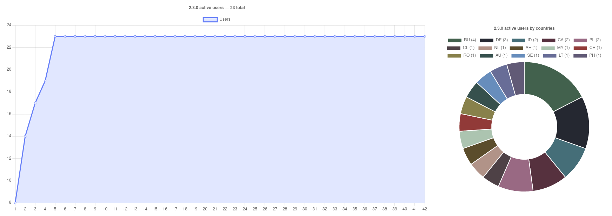

<br><br>

### Please, try to use "An Anime Game" phrase instead of the real game name to avoid search engines parsing

<br><br>

# Status

| Game version | Launcher version | Patch version |
| :---: | :---: | :---: |
| 2.3.0 | 1.9.1 | 2.3.0 stable ✅ |

We have our own [An Anime Game](https://discord.gg/ck37X6UWBp) discord server where you can ask any questions

### AppImage

Download AppImage from [Releases](https://gitlab.com/KRypt0n_/an-anime-game-launcher/-/releases) page

### For arch users

This launcher is also available as the [an-anime-game-launcher-bin](https://aur.archlinux.org/packages/an-anime-game-launcher-bin) AUR repository

<br>

## Usage statistics

### 2.2.0 — 29 total


### 2.3.0 — 73 total



> You can suggest colors for your countries

<br>

# Requirements

To work this launcher requires

| Name | Description |
| --- | --- |
| webkit2gtk | To run Neutralino apps |
| unzip | To unpack zip archives (DXVKs / wines) |
| tar | To unpack tar archives (DXVKs / wines) |
| git | To check for new versions of the launcher |
| curl | To download archives with game, voice data, runners and so on |
| xdelta3 | To apply the patch to the game |
| cabextract | To install fonts to the wine prefix |
| notify-send | To send system notifications |

## Install

### apt-get

```sh
sudo apt-get install unzip tar git curl xdelta3 cabextract notify-send
```

### pacman

```sh
sudo pacman -Syu unzip tar git curl xdelta3 cabextract notify-send
```

### dnf

```sh
sudo dnf install unzip tar git curl xdelta cabextract notify-send
```

# Additional requirements

| Name | Description |
| --- | --- |
| [MangoHud](https://github.com/flightlessmango/MangoHud) | To use MangoHud |
| [vkBasalt](https://github.com/DadSchoorse/vkBasalt) | To use shaders |
| [GameMode](https://github.com/FeralInteractive/gamemode) | To use GameMode (performance optimization) |
| [switcheroo-control](https://gitlab.freedesktop.org/hadess/switcheroo-control/) | To select the GPU launcher should use to run the game |

These requirements can't be easily installed so you should do it manually

They're required only for some specific functions

# Development

## Download

```sh
git clone https://gitlab.com/KRypt0n_/an-anime-game-launcher
cd an-anime-game-launcher
yarn
yarn neu update
```

## Run

```sh
yarn dev
```

## Build

```sh
yarn build
```

# Roadmap

This is our current roadmap goals. You can find older ones [here](ROADMAP.md)

## ➤ To 3.0.0 release

### 2.0.0 release goals - moving launcher to Neutralino

#### Core functionality

* <s>Make `constants` class to store launcher's constants</s>
* <s>Make `Downloader` class to download files</s>
* <s>Make `Archive` class to work with archives</s>
* <s>Make `DXVK` class to manage DXVK installations</s>
* <s>Make `Runners` class to manage wines installations</s>
* <s>Make `Configs` class to manage launcher's configs</s>
* <s>Make `Game` class to control game-related features</s>
  * <s>Ability to parse current installed version</s>
  * <s>Ability to get latest available version</s>
  * <s>Ability to download and install updates</s>
* <s>Make `Voice` class to control voice packages-related features</s>
  * <s>Ability to parse current installed voice packs and get selected one</s>
  * <s>Ability to get latest available voice packs</s>
  * <s>Ability to download and install updates</s>
* <s>Make `Patch` class to control patch-related features</s>
  * <s>Ability to get current installed patch</s>
  * <s>Ability to get latest available patch</s>
  * <s>Ability to download and install it</s>
* Add project binaries bundling
  * <s>AppImage</s> *(seems to be impossible)*
  * One-time small installation script because then launcher will have auto updates

#### Launcher functions

* Make `Launcher` class to manage launcher-related features
  * <s>Downloading progress</s>
  * Launcher state functionality
    * <s>Game launch available</s>
    * <s>Game update (installation) required</s>
    * <s>Voice data update (installation) required</s>
    * Patch unavailable
    * Test patch available
* Make Svelte components
  * <s>Checkbox</s>
  * <s>Selectbox</s>
  * <s>SelectionList</s>
  * SelectableCheckbox
  * PropertiesEditor
* Rewrite sass code, provide more flexible theming ability
* <s>Add `svelte-i18n`</s>
* <s>Telemetry checking</s>
* <s>Tooltips for some options</s>
* <s>Debugger</s>
* <s>Splash screen</s>
* <s>Theming system</s>
* <s>Game pre-installation</s>
* Launcher auto-updates
* Statistics window
* Chengelog window
* Default runner auto-installation
* Ability to change the temp directory where the launcher should download some files

### Features

* <s>Use `LauncherLib.getGameVersion` function instead of the `config.json`'s `version` property</s> *(deprecated due to the new core functions)*
* Add downloading pause button
* Fix button flickering at start when the launcher's state updates
* Screenshots explorer
* Add Patch category in settings menu with
  - Always participate in patches testing
  - Applying anti login crash patch
  - Remove patch
