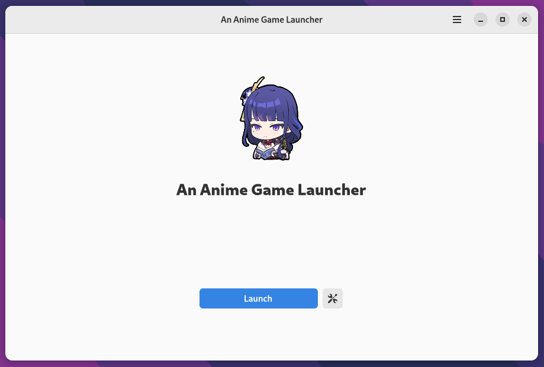
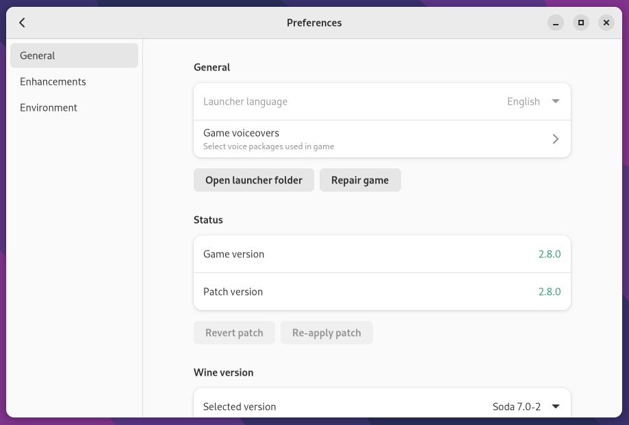

# An Anime Game Launcher GTK

The launcher variant written on Rust, GTK4 and libadwaita, using [Anime Game Core](https://github.com/an-anime-team/anime-game-core) library





<br>

<p align="center">You could also try <a href="https://github.com/an-anime-team/an-anime-game-launcher">the main branch</a></p>

<br>

# Documentation

I wrote small documentation [here](https://github.com/an-anime-team/an-anime-game-launcher-gtk/wiki). It may contain some useful information

# Download

| Source | Link |
| --- | --- |
| Native | [Releases](https://github.com/an-anime-team/an-anime-game-launcher-gtk/releases) page |
| AUR | [an-anime-game-launcher-gtk-bin](https://aur.archlinux.org/packages/an-anime-game-launcher-gtk-bin) |
| Pacstall | [an-anime-game-launcher-gtk-bin](https://pacstall.dev/packages/an-anime-game-launcher-gtk-bin) |
| Ebuild | [an-anime-game-launcher-gtk](https://github.com/an-anime-team/aagl-ebuilds) |

## Flatpak support

To install the launcher via flatpak you will first have to make sure that you have flathub's remote installed

```zsh
flatpak remote-add --if-not-exists flathub https://flathub.org/repo/flathub.flatpakrepo
```

After installing flathub's remote you install launcher.moe's remote

NOTE: You can install the repo on a per user base by appending --user after --if-not-exists (This is especially useful if on Steam Deck)

```zsh
flatpak remote-add --if-not-exists launcher.moe https://gol.launcher.moe/gol.launcher.moe.flatpakrepo
```

Now the only thing remaining is to install the launcher

```zsh
flatpak install launcher.moe moe.launcher.an-anime-game-launcher-gtk
```

Some additional configuration is possible when using the flatpak. For info about this, see [this page](https://github.com/an-anime-team/an-anime-game-launcher-flatpak/blob/rust-launcher/README.md)

## Chinese version support

This should be automatically enabled if you're using zh_cn (Chinese) as your system language. If you're not using it - you'll need to set `China` as your `launcher.edition` in the `config.json` file

# Development

| Folder | Description |
| - | - |
| ui | Blueprint UI files |
| ui/.dist | UI files compiled by the blueprint |
| src | Rust source code |
| target/release | Release build of the app |
| blueprint-compiler | Blueprint compiler |
| anime-game-core | Anime Game Core library |

## Clone repo

```sh
git clone --recursive https://github.com/an-anime-team/an-anime-game-launcher-gtk
```

## Run app

```sh
cargo run
```

## Build app

```sh
cargo build --release
```
