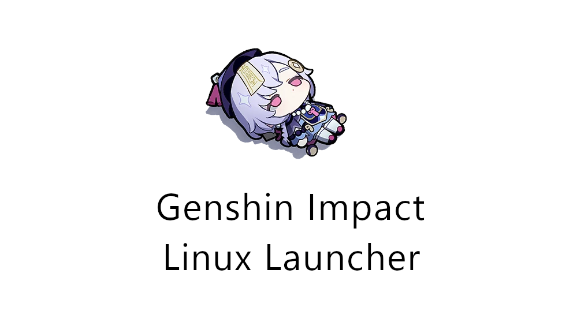
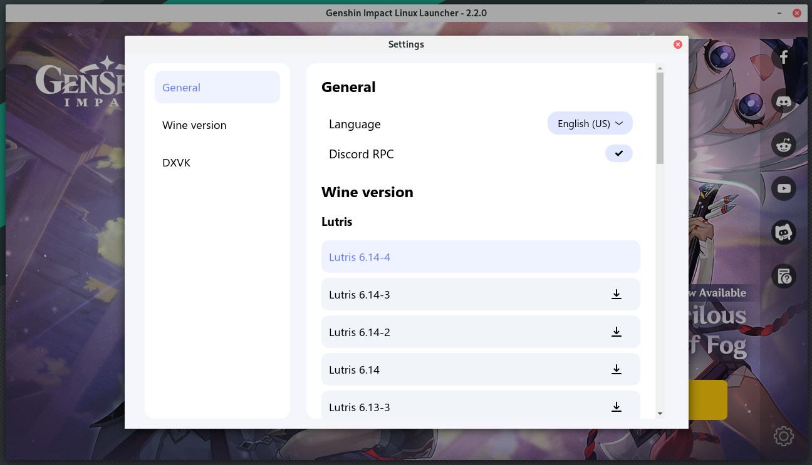
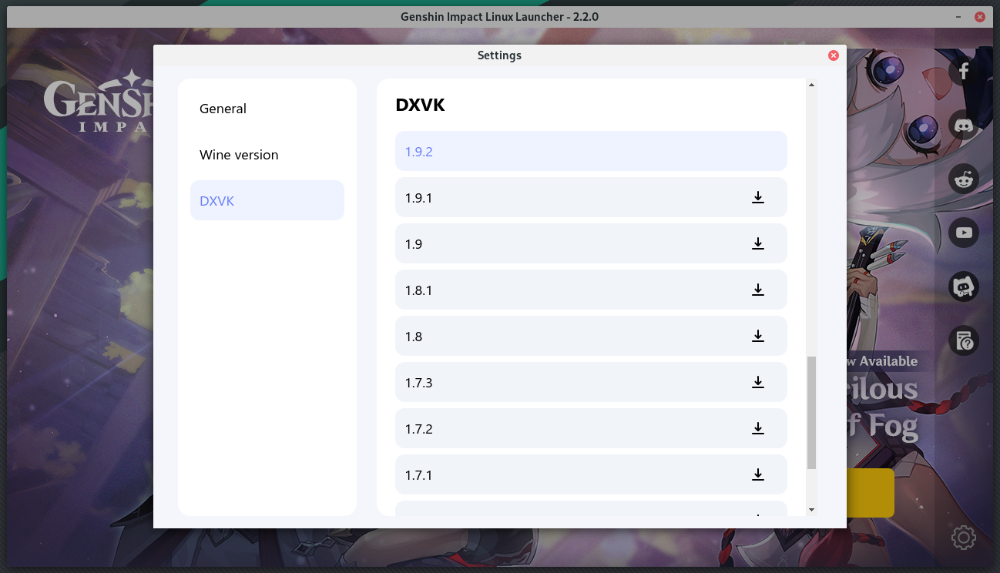

<br><br>

# Status

| Game version | Launcher version | Patch version |
| :---: | :---: | :---: |
| 2.2.0 | 2.2.0-beta7 ⚠️ | 2.2.0-stable ✅ |

Download from [Releases](https://notabug.org/nobody/an-anime-game-launcher/releases)

> ⚠️ Launcher is currently in development, but you already can use it

# Requirements

To work this launcher requires

* wine
* winecfg
* winetricks
* unzip
* tar

# Development

## Build from source

```sh
npm run build
```

## Run from source

```sh
npm start
```

# Roadmap

To 2.2.0-release1

* <s>Fix AppImage builds</s> *(beta 3)*
* <s>Parse background banners from the game's API ([issue #1](https://notabug.org/nobody/an-anime-game-launcher/issues/1), [pull request #2](https://notabug.org/nobody/an-anime-game-launcher/pulls/2))</s> *(beta 3)*
* <s>Update launcher logo</s> *(beta 4)*
* <s>Cache launcher background picture ([pull request #6](https://notabug.org/nobody/an-anime-game-launcher/pulls/6))</s> *(beta 4)*
* <s>Make Proton-GE default compatibility tool and fix game input issues</s> (added runners manager) *(beta 5)*
* <s>Add preferences menu</s> *(beta 5)*
* <s>Add additional telemetry checking</s> *(beta 6)*
* <s>Add DXVK downloading in settings</s> *(beta 6)*
* Add launcher updates notifications
* Make automatical patch state parsing
* Add outdated files deletion when new game's update releases

And don't forget to change the patch's URI when it will be changed

<br>

### Please, try to use "An Anime Game" phrase instead of the real game name to avoid search engines parsing