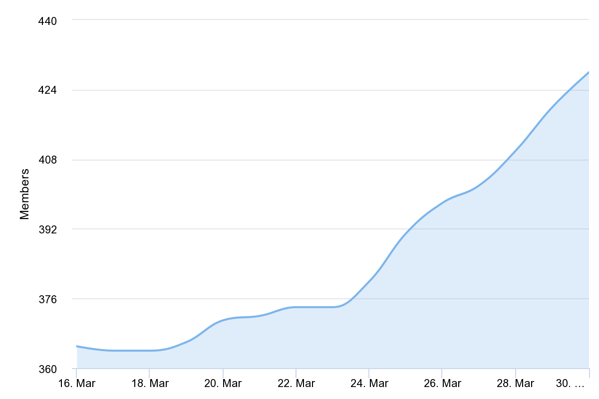

# Usage statistics

This file is a launcher usage statistics archive. You can see here which journey we made to make the launcher looks like it looks

Our current statistics you can find in [readme](../../README.md)

> You can suggest colors for your countries

## 2.6.0

| Period | Source | Data |
| - | - | - |
| 16 Mar — 30 Mar | Discord server |  |
| 6 Apr — 20 Apr | Discord server |  |
| 20 Apr — ? | Discord server |  |

## 2.5.0

| Period | Source | Data |
| - | - | - |
| 20 Feb — 10 Mar | Discord server |  |
| 10 Mar — ? | Discord server |  |

### In-launcher analytics

> Note that this statistics was gathered only from newcomers, so it actually means 154 new users of the launcher

## 2.3.0 — 99 total — in-launcher analytics

## 2.2.0 — 29 total — in-launcher analytics

