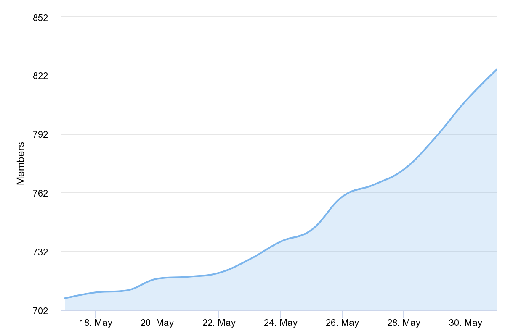
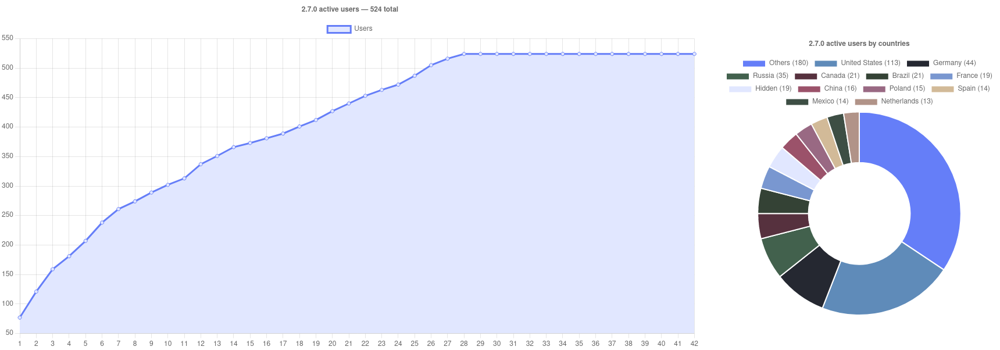
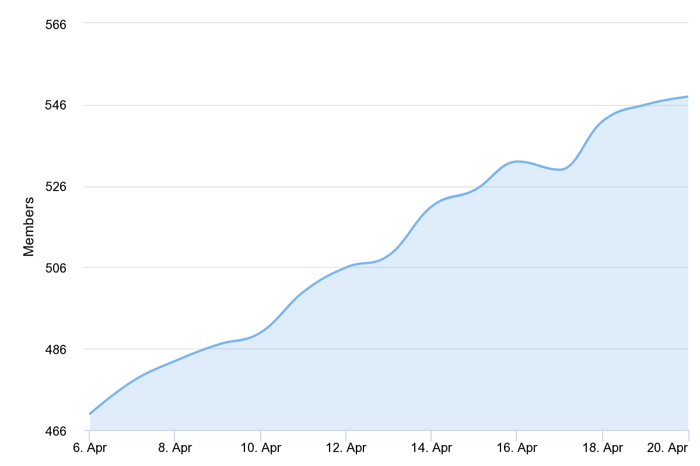
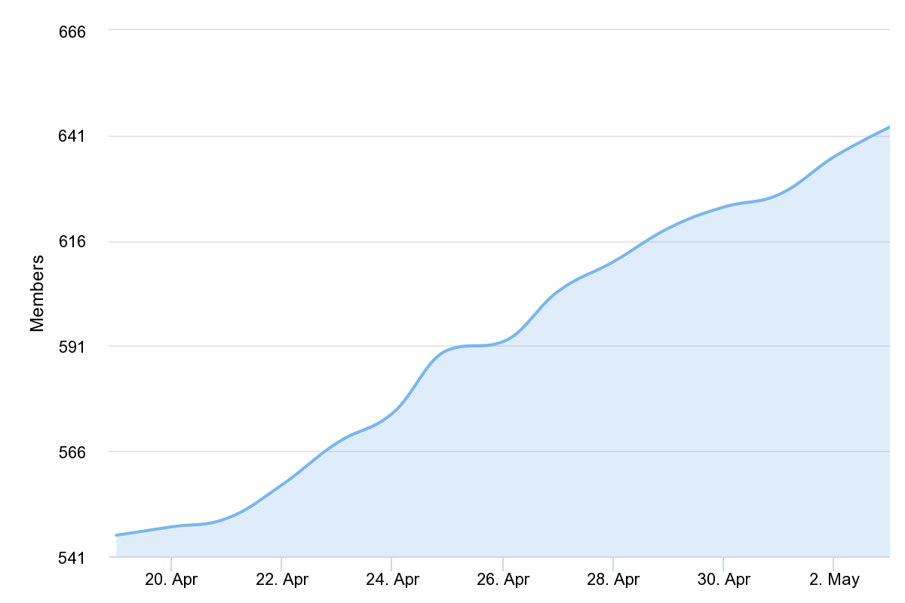
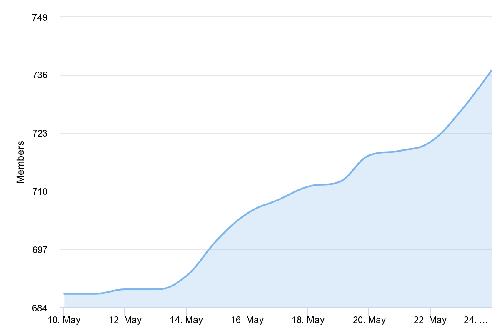
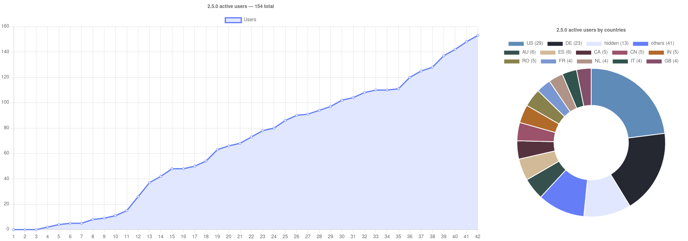

# Usage statistics

This file is a launcher usage statistics archive. You can see here which journey we made to make the launcher looks like it looks

Our current statistics you can find in [readme](../../README.md)

> You can suggest colors for your countries

## 2.7.0

Start date: May 31, 2022

| Period | Data |
| - | - |
| 17 May — 31 May |  |

### Launcher analytics (by users choice)

 

## 2.6.0

| Period | Data |
| - | - |
| 6 Apr — 20 Apr |  |
| 20 Apr — 2 May |  |
| 10 May — 22 May |  |

### Launcher analytics (by users choice)

 

## 2.5.0

| Period | Data |
| - | - |
| 24 Feb — 8 Mar |  |
| 16 Mar — Mar 30 |  |

### Launcher analytics (by users choice)

 

## In-launcher analytics (without discord included)

> Note that this statistics was gathered only from newcomers, so it actually means 154 new users of the launcher

 

## 2.3.0 — 99 total

## 2.2.0 — 29 total

